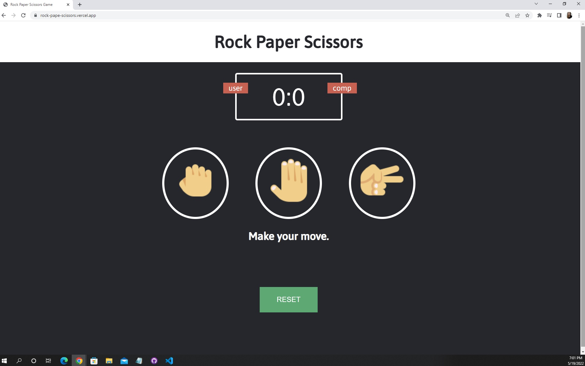

# rock_paper_scissors

Aplicación creada con JavaScript, HTML y CSS para crear el juego Piedra, Papel o Tijera...

# Queres jugar? deploy en: 
https://rock-pape-scissors.vercel.app/

  

## Conceptos claves:
addEventListener()
Math.floor()
Math.random()
sentencias switch